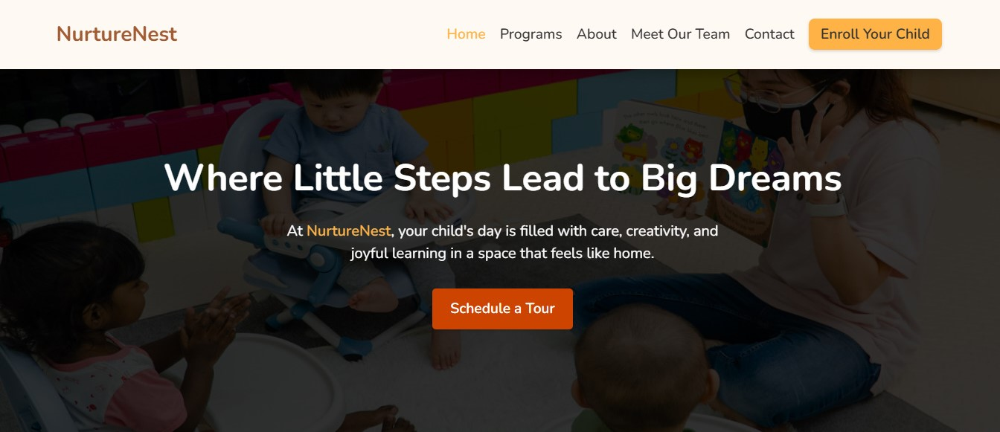
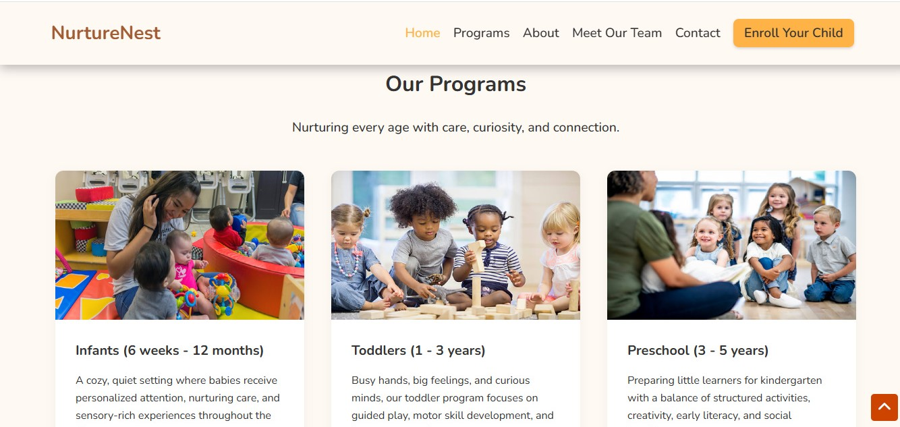

# NurtureNest - Childcare Website

**NurtureNest** is a responsive website for a fictional childcare center. Built with **HTML, CSS, and JavaScript**, it creates a warm and trustworthy experience designed with parents in mind.

## 🌐 Live Demo:

[View the live site](https://nurturenestcare.vercel.app/)

## 📸 Screenshots:

### NurtureNest website Hero section

### NurtureNest website Programs section

## ✅ Features:

**Programs section** - Interactive cards with modals detailing each program 

**Meet the Team** - Showcasing staff to build trust and connection

**Daily Moments gallery** - Responsive photo grid of daily activities

**Testimonials** - Parent quotes as social proof

**Call-to-action banner** - Invite parents to book visits or enroll

## Technologies Used:

**HTML5** - Structuring the website content

**CSS3** - Custom styling with flexbox/grid, animations, responsive design

**JavaScript** - For interactivity: Modals, accordion, dynamic content

## 👤 Author:

**Chijioke Nwabasili**
- Portfolio: [chijiokenwabasili.vercel.app](https://chijiokenwabasili.vercel.app)
- LinkedIn: [Chijioke Nwabasili](https://linkedin.com/in/chijioke-nwabasili)

