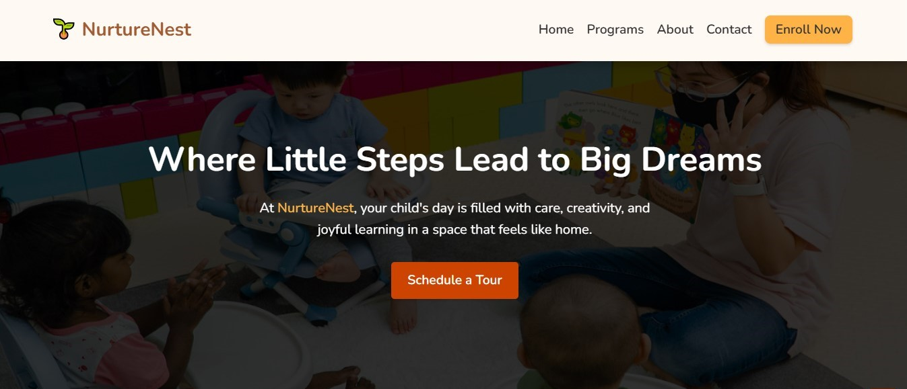
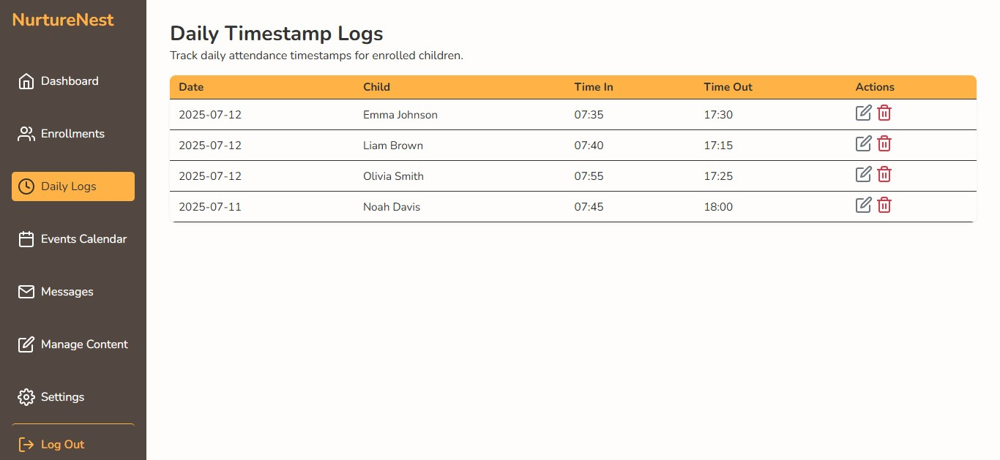

# NurtureNest - Childcare Website

NurtureNest is a modern, multi-page website concept for a fictional childcare center. Built with HTML, CSS, and JavaScript, it offers a warm, calming, family-focused user experience designed to build trust and engagement.

## 🌐 Live Demo:

[View the live site](https://nurturenest.vercel.app/)

## 📸 Screenshots:

### Public-facing website

### Admin dashboard prototype

## Overview:

This self-initiated project demonstrates how a thoughtfully designed childcare website can balance playful visuals with professional structure. NurtureNest targets parents looking for trusted early learning centers by combining informative content, real-world UX patterns, and frontend interactivity. It also hints at how the site could evolve with backend integration in the future.

## Features:

**Multi-page structure** - Home, About, Programs, Contact, Enrollment

**Programs page** - Cards with modals describing each program

**Meet the Team** - Highlights educators and staff to humanize the brand

**Daily Moments gallery** - Responsive photo grid showcasing daily activities

**FAQ accordion** - JavaScript toggle for common parent questions

**Parent testimonials** - Social proof section to build trust

**CTA banners** - Encourage parents to visit or enroll

**Fully responsive design** - Optimized for desktop, tablet, and mobile

## Future Enhancements:

Planned features to extend the project into a dynamic platform include:

- Daily timestamp logs (mock attendance tracking)
- Calendar of events fetched from JSON (mock API)
- Admin login and dashboard UI prototype manage updates and content

## Technologies Used:

**HTML5** - Semantic layout and structure

**CSS3** - Custom styling with flexbox and grid, responsive design

**JavaScript** - Interactivity including modals, accordion, and planned enhancements

## Contributing:

This is a self-initiated concept project aimed at learning and portfolio building. Feel free to fork, explore, or suggest ideas via issues or pull requests. Please note it’s not a fully open-source product but open to feedback and collaboration.

## License:

This project is shared openly for educational and portfolio use only. Attribution is appreciated if you reuse or draw inspiration from any part of the design or code.

## Author:

- Portfolio: [chijioke-nwabasili.vercel.app](https://chijioke-nwabasili.vercel.app)
- LinkedIn: [Chijioke Nwabasili](https://linkedin.com/in/chijioke-nwabasili)

