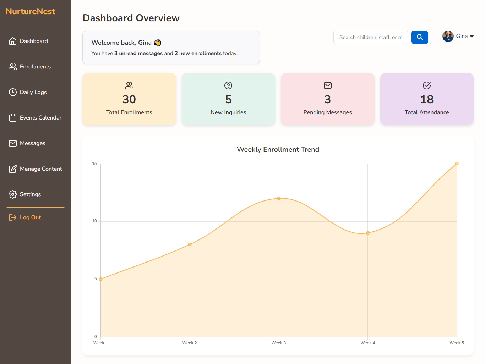

# NurtureNest - Childcare Website

**NurtureNest** is a multi-page, responsive website for a fictional childcare center. Built with **HTML, CSS, and JavaScript**, it creates a warm, calming, and trustworthy user experience designed with parents in mind.

## 🌐 Live Demo:

[View the live site](https://nurturenestcare.vercel.app/)

## 📸 Screenshots:

### Public-facing website

### Admin dashboard prototype

## 📝 Overview:

This self-initiated project explores how a thoughtfully designed childcare site can combine playful visuals with a clean, professional structure. The goal is to present a trustworthy platform that speaks to parents while remaining visually engaging. Alongside the public-facing site, there's also a prototype of an **admin dashboard**, designed to enable staff manage day-to-day operations (daily logs, enrollment records, and site content), showing how the platform might scale into a dynamic, content-driven product.

##  ✅ Features:

### Public-Facing Website

**Multi-page structure** - Home, About, Programs, Contact, Enrollment

**Programs section** - Interactive cards with modals for each program

**Meet the Team** - Showcasing staff to build trust and connection

**Daily Moments gallery** - Responsive photo grid of daily activities

**FAQ accordion** - Toggleable questions built with JavaScript

**Testimonials** - Parent quotes as social proof

**Call-to-action banners** - Invite parents to book visits or enroll

**Responsive design** - Optimized across devices

### Admin Dashboard (Prototype)  

- Sidebar with key sections (Dashboard overview, Enrollments, Daily logs, Messages, Settings)  
- Events calendar loading mock events from JSON  
- Stat cards with dynamic data for enrollments, inquiries, messages, and attendance
- Line chart (Chart.js) showing weekly enrollment trends  
- Forms for updating content (e.g., homepage text, FAQs, activities highlight) 

## 🛠 Technologies Used:

**HTML5** - Semantic structure

**CSS3** - Custom styling with Flexbox/Grid, responsive design

**JavaScript** - For interactivity: Modals, accordion, dynamic content, and logic

**Chart.js** - For data visualization (Line chart) in dashboard 

## 🤝 Contributing:

This is a personal concept project built for learning and portfolio development.  
If you’d like to share feedback, ideas, or ask questions, feel free to explore the [CONTRIBUTING.md](CONTRIBUTING.md) file for details.

## 📄 License:

Shared for educational and portfolio purposes. If you reuse any part of the design or code, please credit the original author.

## 👤 Author:

**Chijioke Nwabasili**
- Portfolio: [chijioke-nwabasili.vercel.app](https://chijioke-nwabasili.vercel.app)
- LinkedIn: [Chijioke Nwabasili](https://linkedin.com/in/chijioke-nwabasili)

